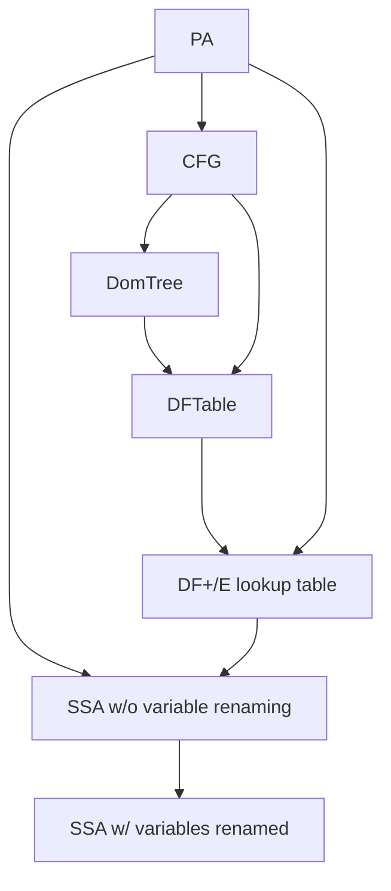

# 50.054 Project Lab 3 (15%)

## Deadline - 15 Dec 2024 23:59

In the previous lab, we completed the big step operational semantics and type inference for SIMP program.

If you have trouble completing lab 2, you can send the instructor an email to ask for the sample solution. 

In this lab, we look into the name analysis, liveness analysis and target code generation of the SIMP language.

## Tasks for this Lab

The three main tasks for this lab include

1. Implementing the algorithm that constructs an SSA form from a Psuedo Assembly program.
1. Implementing the liveness analysis for Pseudo Assembly Programs
1. Implementing the Wasm bytecode generator for Psuedo Assembly Programs 

There is no obvious dependency between the two tasks, hence you can divide the task among your team members if you wish to.


## Prelude 

There several files that we should take note of in this lab. 

* `src/Lang/Simp/Backend/Wasm.hs` - the folder for the Wasm bytecode backend
    * A sub project `haskell-wasm/` (forked and adapted from `https://github.com/SPY/haskell-wasm`). You don't have to modify this sub project. 
* `src/Lang/Simp/IR` - contains the following files
    * `CFG.hs` - the CFG construction module
    * `DF.hs` - the Dominance Frontier construction module
    * `SSA.hs` - the SSA construction module
* `src/Lang/Simp/Lattice/` - contains the modules for Lattice operations
* `src/Lang/Simp/Semantics/LivenessAnalysis.hs` the liveness analysis module 
* `src/Lang/Simp/Semantics/SignAnalysis.hs` - the sign analysis module (which should be completed in the cohort exercise in week 11)

## Task 1 : Constructing SSA (5 marks)

In this task we look into constructing the Static Single Assignment from given a Psuedo Assembly program. 

Recall the flow of constructing of SSA goes as follows



The construction of CFG from PA `CFG.hs` has been implemented, you don't have to update it.
The construction of DomTree from CFG has been given in `DF.hs`

### Sub Task 1.1 

In this sub task, you are supposed to complete the implementation dominance frontier table construction in `DF.hs`. Recall the steps are as follows,

1. traverse the dominator tree in post-order
1. for each vertex, compute the $df_{local}$ and its children's $df_{up}$
    1. union the two components and save it to the table.

You may find the following data structures and functions useful.

* `CFG.hs`
    1. `CFG`
    1. `successors`
* `DF.hs`
    1. `DomTree`
    1. `childOf`
    1. `isChildOf`
    1. `postOrderTrav`

After this sub task, you should be able to pass all the test cases in `Lang.Simp.IR.DFSpec`

### Sub Task 1.2 

In this sub task, you are supposed to complete the implementation of SSA construction in `SSA.hs`.

According to the notes (Cytron's algorithm), there are two steps, 

1. building a Pre-SSA form where phi assignments are inserted to the $DF^+$. 
1. renaming the variables in the a Pre-SSA form.

Step 2 has been implemeneted. Step 1 is incomplete. Fill in the missing parts in `SSA.hs` to complete this step.


You may find the following data structures and functions useful.

* `CFG.hs`
    1. `CFG`
    1. `predecessors`
* `DF.hs`
    1. `dfPlus`
* `SSA.hs`
    1. `PhiAssignment`


When you are done, you should be able to pass all the test cases in `Lang.Simp.IR.SSASpec`


## Task 2 : Liveness Analysis (5 marks)

Recall that liveness analysis aims to discover the set of program variables that may "live", for each program location $l$. 

The idea is 

1. to define the abstract domain of the solution, then
1. to show that the abstract values (as well as the abstract states) are elements from some copmlete lattice.
1. to generate an monotonic equation system (one equation per program location)
    1. each equation defines the relationship between abstract values (from different abstract states, i.e. those arised from adjacent program locations)
    1. re-express the monotonic equation system into a monotone function
1. to apply fixed point algorithm to solve the equation system

For liveness analysis, the abstract states are sets of program variables at each program locations. It is a power set lattice, hence it is a complete lattice. 

The definition of a complete lattice is given as type class `CompleteLattice` (in `CompleteLattice.hs`). The definition of a powerset lattice is given as a type class instance of `CompleteLattice`.


### Sub Task 2.1 

In this task you need to complete the definition of the helper function `join` in `LivenessAnalysis.hs` to *merge* state objects from the previous states. (Hint, recall that liveness analysis is a backward analysis.) 


### Sub Task 2.2 
In addition, you need to complete the definition of the monotone function, `genMonotonFunction`. Note that the type of monotone function in livenesss analysis is `AbstractEnv -> AbstractEnv`, where `AbstractEnv` is a `Map Label AbstractState`. By definition, `AbstractEnv` forms a map lattice.  In this implementation, we generalize the type of the monoetone function to `AbstractEnv -> Either String AbstractEnv` to handle error reporting. 

When you are done, you should be able to pass all the test cases in `Lang.Simp.Semantics.LivenessAnalysisSpec`


## Task 3 : Generating Wasm Bytecodes (3 marks)

Though this task can be completed without the first 2 tasks, you are advised to finish the other two tasks before attempting this task. 

In this task, you are required to complete the partially implemented function `convertInstr`  in `src/Lang/Simp/Backend/Wasm.hs` which emits the Wasm bytecode given a PA labeled instruction.

You may find the following function and data structure useful.


* `src/Lang/Simp/Backend/Wasm.hs`
    1. `convertLabel`
    1. `convertOpr`
* `haskell-wasm/src/Language/Wasm/Builder.hs` 
* `haskell-wasm/src/Language/Wasm/Structure.hs` 
* WebAssembly documentation 
    1. `https://webassembly.github.io/spec/core/bikeshed/`  
* Wasm online disassembler `https://webassembly.github.io/wabt/demo/wasm2wat/`


There is no test suite defined in HSpec.


We should now be able to build an interpreter. 
Check out the code at `app/Main.hs`.

To build and use it, we have two options.

#### Option 1: Using Cabal 

```bash
cabal build
```

Let's say the last line of the build output in the console is 

```bash
[2 of 2] Linking /home/kenny/git/compilerdesign/project/haskell/simp/dist-newstyle/build/x86_64-linux/ghc-9.6.6/simp-0.1.0.0/x/simp/build/simp/simp [Objects changed]
```

Let's make a simple simp program called `fib.simp`

```java
x = input;
f = 0;
s = 1;
c = 0;
t = 0;
while c < x {
    t = f;
    f = s;
    s = t + f;
    c = c + 1;
}
return s;
```

To compile a simp program into wasm, 

```bash
./dist-newstyle/build/x86_64-linux/ghc-9.6.6/simp-0.1.0.0/x/simp/build/simp/simp -c fib.simp fib.wasm fib
```

To execute wasm (requires installation of `https://wasmtime.dev/`)

```bash
wasmtime --invoke fib fib.wasm 30
```
should produce `1346269` as output.


#### Option 2: Using Stack

```bash
stack build
```

Let's say the last line of the build output in the console is 

```bash
simp> Installing executable simp in /home/kenny/git/compilerdesign/project/haskell/simp/.stack-work/install/x86_64-linux/44bc619c9746101ec8790b5e5e71dbd2a7a3cf0b5e156c6e3056070a13a95575/9.6.6/bin
```

Let's make a simple simp program called `fib.simp`

```java
x = input;
f = 0;
s = 1;
c = 0;
t = 0;
while c < x {
    t = f;
    f = s;
    s = t + f;
    c = c + 1;
}
return s;
```


To compile a simp program into wasm, 

```bash
.stack-work/install/x86_64-linux/44bc619c9746101ec8790b5e5e71dbd2a7a3cf0b5e156c6e3056070a13a95575/9.6.6/bin/simp -c fib.simp fib.wasm fib
```

To execute wasm (requires installation of `https://wasmtime.dev/`)

```bash
wasmtime --invoke fib fib.wasm 30
```
should produce `1346269` as output.


Congratulations! Your Simp compiler is done!

## Task 4: (2 marks)

There is no specific requirement for task 4. You are supposed to propose and implement whatever you like related to the simp compiler.
Your proposal must be related to this compiler. Some ideas could be 

1. Build a nice web frontend for Simp. e.g. you can use 
    * `https://www.yesodweb.com/` to write a simple web app that reads the user input as simp source and returns the wasm, which will be deployed and run in the browser. 

1. Target a different backend. 
    * `https://github.com/llvm-hs/llvm-hs` could be a good option. Note htat LLVM IR is very similar to our PA with SSA. 
    * You can make use of this project to generate a different target backend code. 

If you have any other idea, feel free to propose to the instructor. 